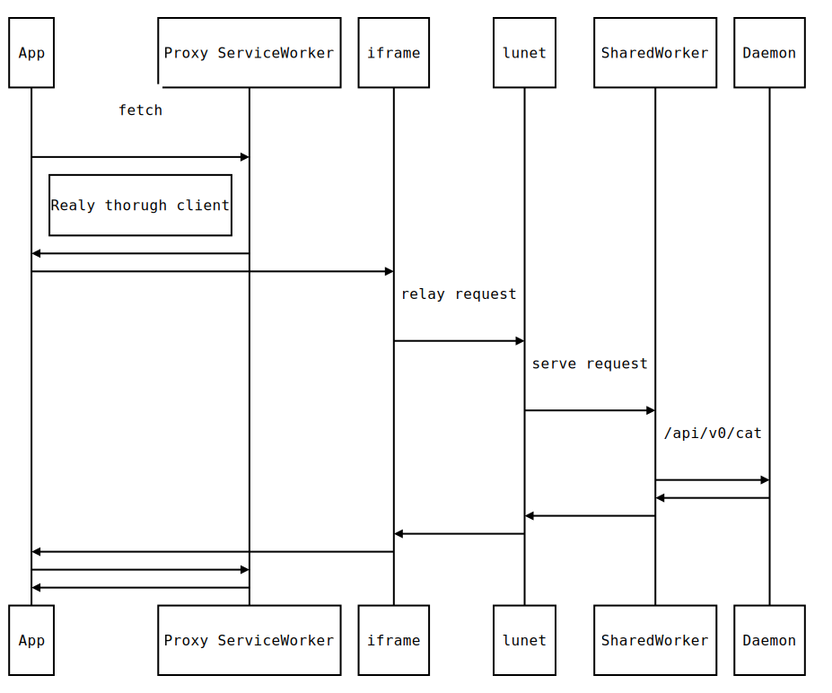

# lunet.link

This is a litte experiment that explores idea progressive peer-to-peer web applications (PPWA) in mainstream browsers. Primary goal is to deliver seamless experience that can be transparently enhanced to truly P2P (as in no server intermediaries) [through the native application][native talk] providing access to the network.

### Status

Current proof of concept provides access to the [IPFS][] network. It assumes [ipfs-desktop][] application installed and runing.

> It should also work with just local IPFS node as long as it has [daemon][ipfs-daemon] and [gateway][ipfs-gateway] active (Which is the a default).

It works on Firefox and Chrome, probably on Edge (don't have access to test) but not on Safari as it [deliberetly](https://bugs.webkit.org/show_bug.cgi?id=171934) chooses to be [incompatible with standards](https://w3c.github.io/webappsec-secure-contexts/#is-origin-trustworthy) and block access to loopback address.

> Support for Safari is likely to be added in the future for details follow along this [discussion thread][].

#### Example PPWA

Assuming [ipfs-desktop][] is running you can try a fork of https://peerdium.com/ that will load / publish documents on [IPFS] network. You can try it at:

https://gozala.io/peerdium/

And browse the source at:

https://github.com/gozala/peerdium

### How is PWAA is setup ?

Application hosts a minimal [static HTML file](https://github.com/Gozala/peerdium/blob/master/docs/index.html) used for bootstrapping app hosted on IPFS. To do this HTML file embeds [lunet client][] implementation (or equivalent) and a pointer to an app resources on IPFS network through a `meta` tag as illustrated below:

```html
<meta
  name="mount"
  content="/ipfs/QmYjtd61SyXU4aVSKWBrtDiXjHtpJVFCbvR7RgJ57BPZro/"
/>

<script type="module" async src="https://lunet.link/lunet/client.js"></script>
```

> You can [browse path mounted](https://webui.ipfs.io/#/explore/QmYjtd61SyXU4aVSKWBrtDiXjHtpJVFCbvR7RgJ57BPZro) through IPLD explorer (Those are just [files from my peerdium fork](https://github.com/gozala/peerdium)).

Application also needs to host static [`lunet.js`] file to setup a [service worker][] which will serve resources from mounted IPFS path through the embedded [lunet client][]. This file just needs to import [lunet proxy][] that takes care of all this:

```js
importScripts("https://lunet.link/lunet/proxy.js")
```

> This file is necessary because [service worker][] can only be registered from the same URL it will serve.

Note that on a first load everything will be setup such that any subsequent loads will be handled by service worker, meaning application will be fully functional offline and it will be loading everything from IPFS network.

### Wait, what ? How ?

When application is first loaded [lunet client][] will install service worker that will act as proxy to the IPFS network. Then it will fetch page corresponding to it's location from IPFS (by resolving path to a mounted path) and update document accordingly. All the linked resources will also be server by service worker and there for be loaded from IPFS network from the mounted path.

Below diagram illustrates a flow through which in this setup browser fetches each resource



Additonally proxy service worker also relays request for `https://lunet.link/api/` to an IPFS [Daemon REST API](https://docs.ipfs.io/reference/api/http/). That is also how [forked peerdium example][peerdium example] [publishes](https://github.com/Gozala/peerdium/blob/960422670399a76d5bbb9aff4f2c1cf704ebf0a9/static/js/editor.js#L97-L108) and [loads](https://github.com/Gozala/peerdium/blob/960422670399a76d5bbb9aff4f2c1cf704ebf0a9/static/js/editor.js#L110-L119) documents out of IPFS network.

> **Warning**: At the moment lunet will allow any embedder to read / write data into local IPFS node. In a future it will request user consent before doing so.

## Next

Next step would be to use in-browser [JS IPFS][] node in case IPFS Daemon is not available.

# Beyond IPFS

This prototype uses IPFS, however you are encouraged to make a [Dat][], [SSB][] or other P2P protocol version to make these kind of applications on the web more mainstream!

[lunet client]: https://github.com/Gozala/lunet/blob/master/docs/lunet/client.js
[ipfs]: http://ipfs.io/
[service worker]: https://developer.mozilla.org/en-US/docs/Web/API/Service_Worker_API/Using_Service_Workers#Updating_your_service_worker
[`lunet.js`]: https://github.com/Gozala/peerdium/blob/master/docs/lunet.js
[lunet proxy]: https://github.com/Gozala/lunet/blob/master/docs/lunet/proxy.js
[peerdium example]: https://gozala.io/peerdium/
[native talk]: https://via.hypothes.is/https://gozala.hashbase.io/posts/Native%20talk.html
[ipfs-desktop]: https://github.com/ipfs-shipyard/ipfs-desktop
[ipfs-gateway]: https://github.com/ipfs/go-ipfs/blob/v0.4.15/docs/config.md#gateway
[ipfs-daemon]: https://github.com/ipfs/go-ipfs/blob/v0.4.15/docs/config.md#api
[discussion thread]: https://github.com/ipfs/in-web-browsers/issues/137
[js ipfs]: https://github.com/ipfs/js-ipfs
[dat]: http://datproject.org/
[ssb]: https://www.scuttlebutt.nz/
